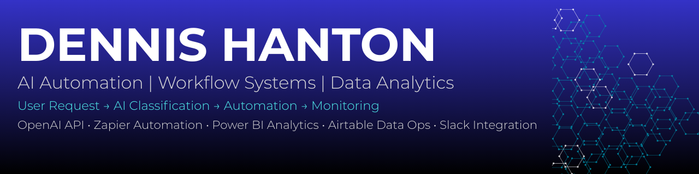

# Dennis Hanton – AI Automation & Data Analytics Portfolio

Welcome to my GitHub portfolio. I build projects that demonstrate **AI workflow automation, operational monitoring, and data visualization** used in modern AI-powered systems.

My work focuses on connecting **AI services, automation tools, and analytics dashboards** to simulate real-world production workflows.

---

# Featured Projects

## AI Lead Qualification System

A production-ready AI-powered pipeline that automatically scores, enriches, and routes inbound leads in real time.

The system replaces manual lead research with structured AI outputs, enabling faster, more consistent sales qualification and decision-making.

**Key Features**

* AI-powered lead scoring (0–100)
* Confidence-based evaluation
* Company analysis and summarization
* Pain point extraction
* Recommended outreach strategy
* Real-time Slack notifications
* CRM-style data storage in Supabase
* Fully automated workflow orchestration

**Tools Used**

* OpenAI
* FastAPI
* n8n
* Supabase
* Slack
* Railway

**Repository**

https://github.com/dennishanton0124-del/lead-qualification-api

---

## AI Intake & Triage Automation System

An AI-powered workflow that automatically classifies and routes incoming user requests.

The system uses OpenAI to analyze incoming messages and determine whether the request should be automatically processed or routed for human review.

**Key Features**

* AI-powered request classification
* Automated routing decisions
* Human review workflows
* Slack notification system
* Airtable workflow tracking

**Tools Used**

* OpenAI
* Zapier
* Airtable
* Slack
* Tally Forms

**Repository**

https://github.com/dennishanton0124-del/ai-intake-triage-system

---

## AI Workflow Monitoring Dashboard

A Power BI dashboard that monitors operational metrics for the AI intake workflow.

The dashboard provides visibility into request volume, AI confidence scores, and automation decisions.

**Key Features**

* Total AI request monitoring
* Automation decision tracking
* AI confidence score distribution
* Request category analytics
* Workflow performance insights

**Tools Used**

* Power BI
* Google Sheets
* CSV datasets
* Data visualization

**Repository**

https://github.com/dennishanton0124-del/ai-intake-triage-workflow-monitoring-dashboard

---

# Skills Demonstrated

* AI workflow automation
* automation pipeline design
* AI operations monitoring
* data visualization
* business intelligence dashboards
* workflow analytics

---

# Tools & Technologies

* Power BI
* OpenAI
* Zapier
* Airtable
* Slack
* Google Sheets
* Data Analytics
